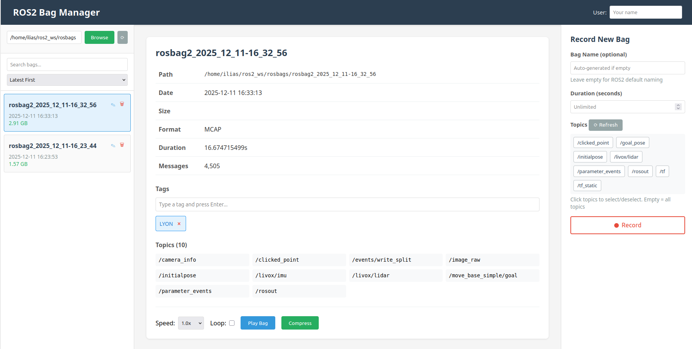

# ROS2 Bag Manager

A simple, web-based tool for managing ROS2 bag files. Built with FastAPI and HTMX for a clean, responsive interface.



## Features

- **Browse and auto-load** ROS2 bags from a folder with instant refresh
- **Search and filter** bags by name, date, or tags
- **Sort bags** by latest, oldest, biggest, or smallest
- **Smart size display** (auto-formats to GB/MB/KB/B)
- **Rename bags** directly from the list with inline editing
- **Tag system** - add simple tags to bags for organization (type and press Enter)
- **Delete bags** with confirmation dialog
- **User tracking** - set your username for recording attribution
- **View bag metadata** - date, size, topics, duration, message count, format (MCAP/DB3)
- **Play bags** with:
  - Adjustable speed (0.5x to 10x) and loop mode
  - Toggle play/stop button (no popups)
  - Real-time terminal output showing ROS2 playback logs
- **Record new bags** with:
  - Auto-generated names (ROS2 default convention) or custom names
  - Duration limits
  - Topic selection with visual chips interface
  - Live topic discovery and refresh
  - Recording state visualization (pulsing dot, stop button)
- **Compress bags** to 7z format
- **Mobile responsive** with burger menu for phone access
- **Modern UI** with clean, responsive design

## Requirements

- Python 3.11+
- ROS2 (any distribution)
- 7z (p7zip-full) for compression
- [uv](https://github.com/astral-sh/uv) - Fast Python package installer

## Installation

1. Install uv (if not already installed):
```bash
curl -LsSf https://astral.sh/uv/install.sh | sh
```

2. Install system dependencies:
```bash
sudo apt install p7zip-full
```

3. Install Python dependencies:
```bash
uv pip install -e .
```

Or install manually:
```bash
uv pip install fastapi uvicorn jinja2 python-multipart aiofiles
```

## Usage

1. Start the server:
```bash
uv run app.py
```

Or activate the virtual environment first:
```bash
source .venv/bin/activate
python app.py
```

2. Open your browser and navigate to:
```
http://localhost:8000
```

3. Enter your username in the header (optional, saved between sessions)

4. Click "Browse" to select your bags folder
   - Bags are automatically loaded when you select a folder
   - Use the refresh button (⟳) to reload bags
   - Your folder selection is saved between sessions

5. Manage your bags:
   - **Search**: Type in the search box to filter by name, date, or tags
   - **Sort**: Choose from latest, oldest, biggest, or smallest
   - **Rename**: Click the edit icon (✎) next to any bag name
   - **Delete**: Click the trash icon (🗑) to delete a bag (with confirmation)
   - **Select**: Click any bag to view detailed information

6. View bag details:
   - Compact table layout with all metadata
   - **Tags**: Type a tag and press Enter to add, click × to remove
   - Topics displayed in a clean grid
   - Format type (MCAP or DB3)
   - Size auto-formatted (GB/MB/KB)

7. Play bags:
   - Select playback speed (0.5x to 10x)
   - Enable loop mode for continuous playback
   - Click "Play Bag" to start (button turns to "Stop Playback")
   - View real-time terminal output showing ROS2 logs

8. Record new bags (right panel):
   - Leave name empty for auto-generated ROS2 naming
   - Set optional duration limit
   - Click "⟳ Refresh" to load available topics
   - Click topics to select/deselect (chips turn green)
   - Empty selection = record all topics
   - Click the red "Record" button to start
   - Button changes to "Recording..." with pulsing dot
   - Stop button appears during recording

## Mobile Usage

On mobile devices (≤768px width):
- **Default view**: Full-screen recording interface for easy access
- **Burger menu (☰)**: Tap the floating button to access bag list
- **Select a bag**: Tap to open bag details from the right
- **Close panels**: Tap the "Close" button or tap outside the panel

## Features in Detail

### Bag Selection
- Click "Browse" to open a folder selection dialog
- The selected folder path is automatically saved and restored on next launch
- All bags are loaded and displayed with date and size
- Click on any bag to view detailed information

### Bag Information
- Path, date, and size
- Duration and message count
- List of all topics in the bag

### Playback Controls
- Adjustable playback speed (0.5x, 1x, 2x, 5x, 10x)
- Loop mode for continuous playback
- One-click play button

### Recording
- Record new bags with custom names
- Optional duration limit (in seconds)
- Record all topics or specific comma-separated topics
- Bags saved to the currently selected folder

### Compression
- Compress bags to 7z format with one click
- Useful for archiving or saving space

## File Structure

```
rosbag_manager/
├── app.py                     # Main FastAPI application
├── templates/
│   ├── index_new.html        # Main page template with mobile support
│   └── bag_info_updated.html # Bag info component with tags
├── doc/
│   └── gui.png               # Screenshot
├── bags_metadata.json        # Auto-generated metadata file (gitignored)
├── config.json               # User preferences (gitignored)
├── pyproject.toml            # Python project configuration
└── README.md
```

## Testing

See [TESTING.md](TESTING.md) for detailed testing instructions and example commands.

Quick test command after starting a recording:
```bash
ros2 topic pub /test_topic std_msgs/msg/String "data: 'Hello ROS2'" -r 10
```

## TODO

- [ ] Add merge topic option with topic choices
- [ ] Enable compression and preview by default
- [ ] Make it run in background (Docker or executable)
- [ ] Deliverable as Docker container or standalone executable

## Notes

- Metadata (including tags) is automatically saved to `bags_metadata.json`
- User preferences (last folder, username) are saved to `config.json`
- Both files are gitignored for privacy
- The server runs on port 8000 by default
- Bag playback and recording run in separate processes
- Terminal output is captured and streamed in real-time during playback
- Compressed files are saved with .7z extension in the same directory
- The folder browser uses tkinter, which should be included with Python
- Both MCAP and DB3 bag formats are supported
- Mobile-responsive design works on phones and tablets

